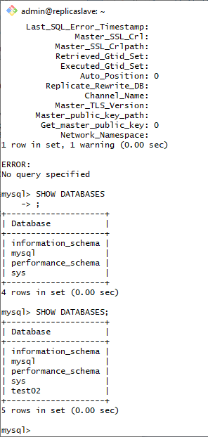

# Домашнее задание к занятию 12.6. «Репликация и масштабирование. Часть 1» - Серебряков Р.А.

### Задание 1

На лекции рассматривались режимы репликации master-slave, master-master, опишите их различия.

*Ответить в свободной форме.*

Репликация master-slave это вид репликации при котором несколько серверов (slave) подключаются к одному (master) и начинают реплицировать его данные. 
(Репликация происходит по умолчанию в режиме mixed. Т.к. раньше было 2 типа репликации 1-е по командный и построчный. Но т.к. по отдельности первый способ давал расхождения при первом же "RANDOM", а второй не всегда эффективно использовать - их объединили в режим mixed который эффективно использует первый и второй способы когда это нужно.)
Основная работа происходит на  master, а slave реплицируют с него данные. Если вдруг откажет один из slaveов то ничего страшного не произойдёт, по восстановлению slave подключится к masterу и возможно часть данных станет доступна только для чтения, но это все равно лучше чем репликация master-master.

Репликация master-master... Возможно она даёт некоторый прирост производительности но... Все её преимущества меркнут после первого же лага соединения между серверами. Т.к. оба сервера являются мастерами, то может возникнуть такая ситуация, когда из-за лага создались данные которые используют 1 и тот же уникальный ID и непонятно кто неправ. Повезло если вся эта история не поехала дальше. Но если произошёл лаг и заметили это спустя долгое время - может возникнуть очень серьёзный инцедент который принесет большие потери бизнесу.

---

### Задание 2

Выполните конфигурацию master-slave репликации, примером можно пользоваться из лекции.

*Приложите скриншоты конфигурации, выполнения работы: состояния и режимы работы серверов.*

Конфигурация master
IP 192.168.0.29

Конфигурация slave. 
IP 192.168.0.26

Slave

Проверяем синхронизацию и БД.

В это время на master создаём базу данных

---

## Дополнительные задания (со звёздочкой*)
Эти задания дополнительные, то есть не обязательные к выполнению, и никак не повлияют на получение вами зачёта по этому домашнему заданию. Вы можете их выполнить, если хотите глубже шире разобраться в материале.

---

### Задание 3* 

Выполните конфигурацию master-master репликации. Произведите проверку.

*Приложите скриншоты конфигурации, выполнения работы: состояния и режимы работы серверов.*

